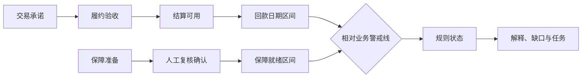

# 潮汐 0.2 竞赛方案

| 元信息 | 内容 |
| --- | --- |
| 文档版本 | 0.2.0 |
| 文档状态 | 现行竞赛基线，调研结论待补 |
| 负责人 | 竞赛负责人、产品负责人 |
| 更新时间 | 2026-09-02 |
| 关联文档 | [路演叙事](pitch-narrative.md)、[证据台账](evidence-register.md)、[PRD](../02-product/prd.md)、[Demo 规格](../05-delivery/demo-spec.md) |

## 1. 项目摘要

潮汐是一项面向供应链小微企业经营周转的回款—周转保障双时钟证据协同服务。小微企业在“订单已形成—履约待完成—结算未可用”的间隔中，常出现时间错配：回款日期被不同人员按不同依据理解，备用安排的条件与责任人不清晰，风险沟通因此停留在口头催问和模糊预警。

潮汐以业务警戒线为共同参照，把关键回款拆为交易承诺、履约验收、结算可用三段证据链，把备用经营安排、材料准备和人工确认组织为周转保障证据链。确定性规则只根据有效日期区间判定稳态、回款承压、周转保障承压、双重承压或待核验；证据只决定能否计算和解释置信度。输出不是授信结论，而是风险解释卡、核验任务、企业行动清单和经授权的协同摘要。

一句话价值主张：在警戒线前，把“日期从何而来、证据是否够用、谁应完成什么动作”说清楚。

## 2. 问题与机会

供应链小微企业的订单、交付、验收、结算和经营支出不在同一时间发生。传统表格或沟通记录往往只存一个预计回款日，无法同时表达区间、不确定性、证据阶段、有效期与责任动作；单一红黄绿预警也很难解释状态为什么变化。

潮汐聚焦三个可验证问题：

1. 预计回款日是否有从交易承诺到结算可用的证据链，而不是单一口头日期。
2. 回款晚于警戒线时，周转保障何时具备人工确认条件，缺的是材料、安排还是复核。
3. 证据变化后，状态、置信度和任务为什么变化，是否保留规则结果和人工处理痕迹。

人民银行资金流信用信息共享平台、工行数字供应链公开方案及金融机构人工智能全生命周期治理要求，说明行业重视可信数据、供应链协同、可解释与治理能力。它们只证明方向相关性，不代表潮汐已获得数据、合作或生产接入。具体依据见[证据台账](evidence-register.md)。

## 3. 目标用户与工行业务关联

| 角色 | 当前困难 | 潮汐提供的能力 |
| --- | --- | --- |
| 企业经营者 | 不清楚应先补哪项材料，也难解释预计日期的依据。 | 企业行动清单、脱敏证据摘录、授权确认与撤回。 |
| 普惠服务人员 | 信息分散，重复催问，状态变化缺少统一解释。 | 双时钟看板、证据护照、核验任务和协同摘要。 |
| 风险复核人员 | 需要区分规则事实、材料质量和人工判断。 | 原规则解释、置信等级、人工覆盖理由和审计记录。 |

与工行业务的联系是普惠小微与数字供应链服务场景的“证据协同层”构想。原型不冒充工行产品，不调用工行客户、账户、授信或核心系统数据；若未来获得正式授权，才可在数据最小化、接口隔离和人工终审下评估适配。

## 4. 解决方案

### 4.1 回款三证链

回款时钟不直接接受一个不可解释的日期。证据按交易承诺、履约验收、结算可用三个阶段组织，并记录来源、用途、有效期、核验状态、脱敏摘录和可见角色。日期有效且每条链至少有一条当前证据时可显示四象限；关键阶段未核验时置信度保持低。

### 4.2 周转保障链

周转保障描述材料准备、替代经营安排、第三方支持信息或其他合规路径何时具备人工确认条件。它不意味着贷款批准、担保生效或资金到账。证据链至少包含保障准备和人工复核确认阶段。

### 4.3 双时钟与解释

状态由日期区间决定，证据决定计算资格和置信度。区间跨越警戒线、主节点不唯一、日期无效或全部证据失效时进入待核验，不用区间中点猜测。

### 4.4 假设情景沙盘

用户可临时修改警戒线、主回款区间、主保障区间和指定证据状态，比较基线与模拟解释、状态、置信度、原因和任务差异。沙盘不修改正式案例、种子数据或审计记录，页面必须标记“假设情景”。

### 4.5 人工复核与授权

人工覆盖必须保留规则状态、双时钟差值、原解释、操作者和理由。企业授权只控制协同摘要的导出与可见范围；授权撤回后，任何后续导出均被拒绝，并记录尝试。

## 5. 差异化

| 对比对象 | 典型目标 | 潮汐的边界与差异 |
| --- | --- | --- |
| CRM | 管理客户联系、商机和跟进。 | 潮汐管理证据阶段、日期区间、警戒线和规则解释，不替代客户关系管理。 |
| 信用评分 | 估计信用表现或风险概率。 | 潮汐不评分、不预测违约，只解释时间与证据条件。 |
| 智能尽调 | 自动汇总资料、生成审查辅助。 | 潮汐只从脱敏材料提出候选，候选须人工接受和核验后才能影响正式证据。 |
| 普通预警看板 | 以阈值显示红黄绿。 | 潮汐同时展示双时钟、证据准备度、缺口、责任任务和状态变化理由。 |

核心创新不是“再做一个预测模型”，而是把时间、证据、责任和授权组成可验证的协同协议。

## 6. 原型实现基线

0.2.0 已实现 TypeScript 共享契约、确定性领域规则、非持久化沙盘、行业中性种子案例和离线确定性提取器。提取器只识别固定模拟文本中的日期、阶段和脱敏引用片段，输出 `PENDING_REVIEW` 候选；接受后生成的证据仍为 `PENDING`。

尚未建设 React 页面、Fastify 服务、SQLite 数据库、真实模型或生产接口。下一阶段才按[开发路线](../05-delivery/development-roadmap.md)建设完整本地 Demo。

## 7. 主案例与演示结果

`CASE-DEMO-001` 参考日为 2026-09-01，警戒线为 2026-10-01。初始回款区间为 2026-10-13 至 2026-10-19，周转保障区间为 2026-10-26 至 2026-11-30；交易承诺已核验，履约与结算待核验，初始结果为 `DUAL_PRESSURE + LOW`。

在假设情景中，人工核验履约与结算证据，并把回款区间调整为 2026-09-26 至 2026-09-29，结果变为 `SAFEGUARD_PRESSURE + MEDIUM`。这只说明回款压力在该假设下缓解，周转保障仍晚于警戒线，绝不能显示“已解决”。

## 8. 社会价值与可验证指标

潮汐希望降低小微企业在经营周转沟通中的信息不对称与重复补证成本，提升服务人员解释一致性和人工复核可追溯性。现阶段这些均为原型假设。验证指标为：用户能否正确解释状态、能否找到首要证据缺口、能否在限定时间完成任务、能否理解授权撤回影响。

不使用“提高通过率”“降低不良率”“准确率达到某值”等未经样本和正式评估支持的指标。

## 9. 调研与证据门槛

最低门槛为两类角色访谈、两份完全脱敏案例和一条专业人士文字反馈。只保存匿名结论，不保存录音、原始合同、企业名、账户、精确金额或可逆识别组合。主案例由五类节点完整度与脱敏风险共同决定；若两份案例均不满足，继续使用供应链模拟案例。

截至本版本，上述实证材料尚未全部收集，因此竞赛中的用户价值、效率改善和行业适配结论均标注为“原型假设”。

## 10. 合规边界

- 禁止自动授信、审批结论、通过率预测、自动续贷、自动处置。
- 禁止宣称已接入工行或掌握真实授信、征信、账户和客户数据。
- 禁止把置信等级解释为违约概率。
- 禁止把沙盘结果、提取候选或任务完成直接写成正式结论。
- 未取得有效授权或授权已撤回时禁止导出协同摘要。
