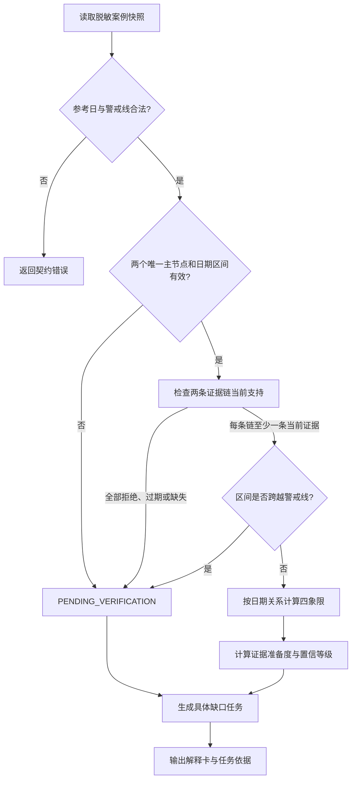
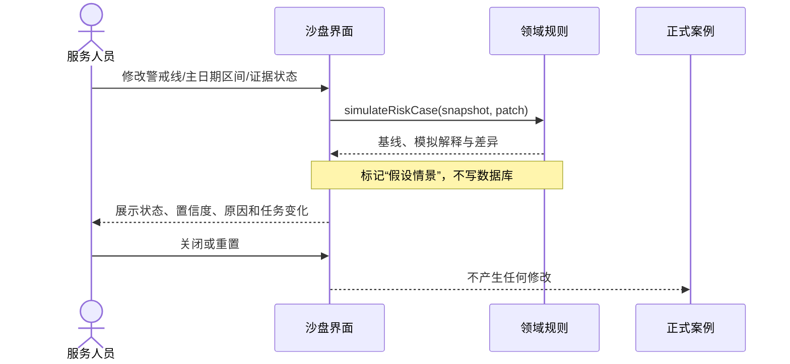
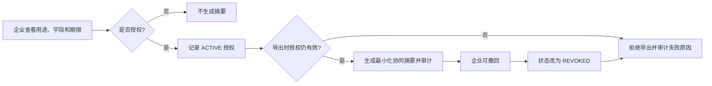

# 用户流程

| 元信息 | 内容 |
| --- | --- |
| 文档版本 | 0.2.0 |
| 文档状态 | 现行流程基线，界面待实现 |
| 负责人 | 产品负责人、交互负责人 |
| 更新时间 | 2026-09-02 |
| 关联文档 | [PRD](prd.md)、[角色与场景](personas-and-scenarios.md)、[状态机](../03-domain/state-machine.md)、[Demo 规格](../05-delivery/demo-spec.md) |

## 1. 案例计算流程

## 2. 证据核验流程

1. 服务人员查看证据护照和缺失阶段，不直接修改规则状态。
2. 系统可从固定脱敏材料提出 `PENDING_REVIEW` 候选。
3. 用户接受候选后生成 `PENDING` 结构化证据；拒绝候选则只保留候选决定。
4. 风险复核人员检查脱敏摘录、阶段、用途和有效期，设为 `VERIFIED` 或 `REJECTED`。
5. 用户显式触发重新计算，产生新解释和审计事件。
6. 任务完成只记录动作完成；若证据或日期未改变，规则状态保持不变。

## 3. 沙盘流程

未来若用户希望将情景变为正式状态，必须另走“明确提交 → 权限检查 → 人工确认 → 正式重算 → 审计”的流程，不能复用临时沙盘结果直接保存。

## 4. 人工复核与覆盖流程

复核人员先查看规则状态、日期差、证据准备度和原解释，再输入不可为空的覆盖理由。系统保存规则状态、有效状态、理由、操作者、时间和证据版本；任何后续重算都生成新记录，不覆盖历史。企业侧只看适合其角色的解释，不展示内部复核备注。

## 5. 授权与导出流程

## 6. 桌面与手机衔接

桌面端由服务与复核角色完成案例、证据、沙盘、任务和审计操作；手机端只让企业查看行动清单和解释卡、确认或撤回授权。两端读取同一授权状态，撤回后桌面端不得使用旧页面缓存继续导出。

## 7. 错误反馈

错误信息必须指出对象、原因和可恢复动作。例如“主回款区间跨越业务警戒线，请缩小区间或提交人工核验”，不能只显示“计算失败”。权限或授权失败不暴露隐藏字段；离线演示异常应允许一键重载种子案例。
