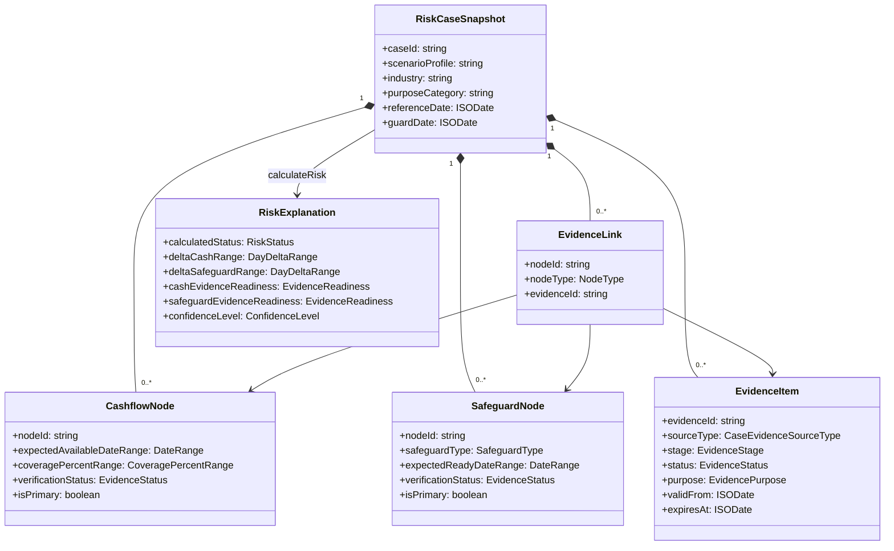

# 领域模型

| 元信息 | 内容 |
| --- | --- |
| 文档版本 | 0.2.0 |
| 文档状态 | 已实现领域基线 |
| 负责人 | 领域负责人 |
| 更新时间 | 2026-09-02 |
| 关联文档 | [双时钟规则](dual-clock-rules.md)、[证据护照](evidence-passport.md)、[沙盘](scenario-simulation.md)、[数据模型](../04-architecture/data-model.md) |

## 1. 聚合边界

`RiskCaseSnapshot` 是一次计算的不可变输入快照，包含案例上下文、参考日、业务警戒线、回款节点、周转保障节点、运行时证据和证据关联。规则引擎不读取外部状态，不写审计记录；服务层未来负责持久化、权限和事件记录。

| 实体/值对象 | 责任 | 关键约束 |
| --- | --- | --- |
| `RiskCaseSnapshot` | 聚合一次正式或模拟计算所需数据。 | `caseId` 稳定；参考日和警戒线为合法日期。 |
| `CashflowNode` | 表达预计回款可用区间和覆盖比例。 | 每个案例恰有一个主节点；比例范围 0–100 且下界不大于上界。 |
| `SafeguardNode` | 表达周转保障预计具备人工确认条件的区间。 | 每个案例恰有一个主节点；类型来自固定枚举。 |
| `EvidenceItem` | 表达运行时证据护照。 | 阶段、状态、用途、来源和可见角色必填。 |
| `EvidenceLink` | 建立节点与证据多对多关联。 | 引用必须存在且节点类型匹配。 |
| `RiskExplanation` | 输出规则状态、差值、准备度、置信度、原因、缺口和任务。 | 不含授信结论和违约概率。 |
| `VerificationTask` | 将证据缺口与压力状态转为责任动作。 | 有依据、角色、优先级；完成不自动改状态。 |
| `ManualOverride` | 保存规则结果上的人工判断。 | 理由必填；原解释不可覆盖。 |
| `Authorization` | 控制协同摘要用途、范围和期限。 | 撤回即时阻断后续导出。 |
| `AuditEvent` | 记录关键行为。 | 追加式、不可静默删除或改写。 |

## 2. 关系图

## 3. 节点类型

`SafeguardType` 只允许：`MATERIAL_READINESS`、`ALTERNATIVE_OPERATING_ARRANGEMENT`、`THIRD_PARTY_SUPPORT_INFORMATION`、`OTHER`。这些类型表达“能否形成可供人工确认的信息或安排”，不表达金融产品状态。

回款覆盖比例使用 `{ minPercent, maxPercent }`，避免把“60%–80%”作为无法验证的展示字符串。日期一律使用闭区间 `{ start, end }`；单日表示为起止相同。

## 4. 运行时证据与竞赛证据分离

运行时 `CaseEvidenceSourceType` 仅允许模拟文档、模拟系统事件、经同意脱敏事实和人工复核记录。公开政策、行业报告、访谈可信等级和专业反馈只存在竞赛证据台账，不得被链接到案例节点或提升置信等级。

## 5. 规则状态与有效状态

领域函数计算 `calculatedStatus`。未来服务层持久化时，案例还需同时保存 `ruleStatus` 与 `effectiveStatus`：无人工覆盖时二者一致；有人工覆盖时有效状态可以不同，但原规则状态、差值和解释仍可见。人工覆盖不能回写历史快照。

## 6. 不变量

- 每类节点恰有一个主节点，否则待核验。
- 参考日合法，警戒线不早于参考日；非法输入返回错误。
- 日期区间起日不晚于止日；覆盖比例满足范围约束。
- 当前证据不能是拒绝或过期状态，也不能尚未生效或已超过有效期。
- 状态只由日期规则产生；证据不直接把承压状态改为稳态。
- 提取候选不属于 `EvidenceItem`；只有接受后才形成待核验证据草稿。
- 沙盘以深拷贝运行，不修改输入对象。
