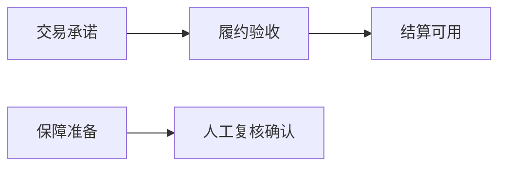
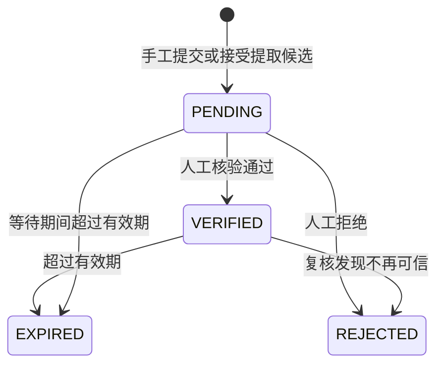

# 证据护照

| 元信息 | 内容 |
| --- | --- |
| 文档版本 | 0.2.0 |
| 文档状态 | 已实现领域基线 |
| 负责人 | 领域负责人、隐私负责人 |
| 更新时间 | 2026-09-02 |
| 关联文档 | [领域模型](domain-model.md)、[双时钟规则](dual-clock-rules.md)、[隐私安全](../04-architecture/privacy-security.md)、[接口契约](../04-architecture/api-contract.md) |

## 1. 目的

证据护照为每条运行时证据提供统一身份和使用边界，使日期结论可以回答“来自什么模拟或脱敏来源、处于哪个阶段、用于什么目的、何时有效、谁能看、谁核验过”。它不保存原始合同、账户、企业名或可识别金额。

## 2. 字段

| 字段 | 必填 | 规则 |
| --- | --- | --- |
| `evidenceId` | 是 | 案例内稳定唯一，不包含客户或企业标识。 |
| `sourceType` | 是 | 四种运行时来源之一。 |
| `stage` | 是 | 五个证据阶段之一。 |
| `status` | 是 | `PENDING`、`VERIFIED`、`REJECTED`、`EXPIRED`。 |
| `purpose` | 是 | 风险解释、核验任务或协同摘要。 |
| `summary` | 是 | 脱敏后的结构化结论，不复制原文。 |
| `sourceExcerpt` | 否 | 最小必要脱敏片段，最长值由服务层限制。 |
| `validFrom` | 否 | 证据开始有效日期；晚于参考日时暂不参与。 |
| `expiresAt` | 否 | 有效期结束日期；早于参考日时不参与。 |
| `visibilityRoles` | 是 | 至少一个可见角色，服务层执行权限校验。 |

## 3. 来源

| 来源 | 用途 | 置信约束 |
| --- | --- | --- |
| `SIMULATED_DOCUMENT` | 固定演示材料。 | 即使完整也不能单独支撑高置信度。 |
| `SIMULATED_SYSTEM_EVENT` | 固定演示事件。 | 同上。 |
| `CONSENTED_ANONYMIZED_FACT` | 获得同意后保存的完全脱敏事实。 | 可参与高置信度条件。 |
| `MANUAL_REVIEW_NOTE` | 授权复核人员形成的结构化记录。 | 可参与高置信度条件。 |

来源描述的是运行时证据取得方式，不是公开资料的证据等级。竞赛研究材料不得转换成运行时来源以提高案例置信度。

## 4. 阶段与所需链

回款链需要前三阶段，周转保障链需要后两阶段。阶段不要求严格按时间提交，但解释必须显示缺失和待核验阶段，不能因为后置材料存在就假定前置阶段成立。

## 5. 生命周期

提取候选有独立的 `PENDING_REVIEW`、`ACCEPTED`、`REJECTED` 生命周期。候选 `ACCEPTED` 只会创建证据 `PENDING`，不会创建 `VERIFIED`。

## 6. 当前有效性与核验

一条证据参与当前支持需要：状态不是拒绝或过期，`validFrom` 为空或不晚于参考日，`expiresAt` 为空或不早于参考日。高置信度还要求相应所需阶段至少有一条当前 `VERIFIED` 且来源可信的证据。

人工核验至少检查阶段是否匹配、摘录是否已脱敏、日期是否来自可说明依据、用途与可见角色是否最小、有效期是否合理。核验动作写审计事件，不能只改界面标签。

## 7. 授权和可见性

`visibilityRoles` 决定应用内可见范围，企业授权决定跨角色导出范围，两者必须同时满足。撤回授权不删除合法留存的审计事实，但立即阻断新的协同摘要生成，不允许使用缓存绕过。

## 8. 脱敏规则

证据只保留相对关系或区间化信息；删除企业、客户、项目、账户、合同和人员身份；精确金额改为比例范围或非可逆区间；摘录必须可独立审查且不能与其他字段组合再识别。调研原始材料不进入项目仓库。
