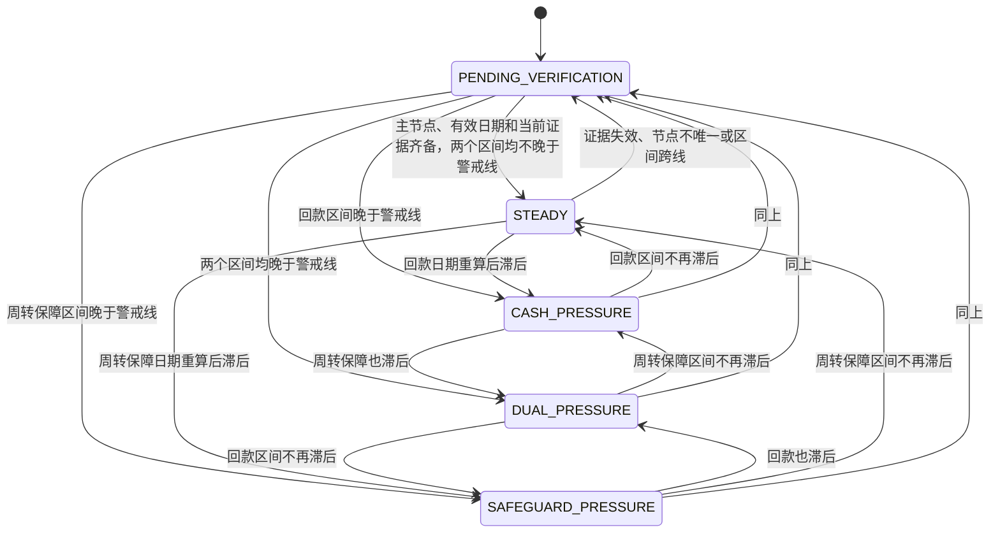
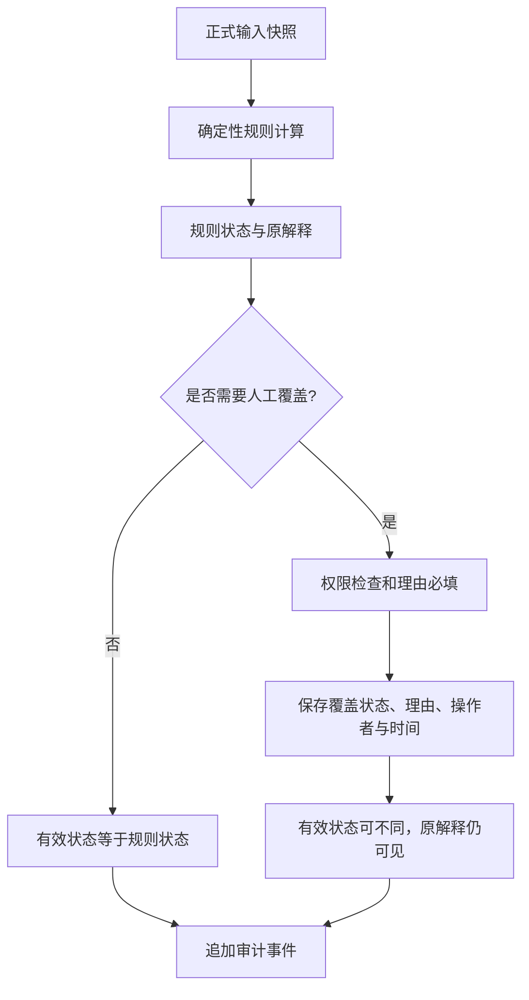

# 状态机与人工闭环

| 元信息 | 内容 |
| --- | --- |
| 文档版本 | 0.2.0 |
| 文档状态 | 已实现规则状态，持久化闭环待开发 |
| 负责人 | 领域负责人、风险规则负责人 |
| 更新时间 | 2026-09-02 |
| 关联文档 | [双时钟规则](dual-clock-rules.md)、[证据护照](evidence-passport.md)、[用户流程](../02-product/user-flows.md) |

## 1. 规则状态机

规则状态不是由事件直接“推进”，而是在每次输入变化后重新计算。下图描述可观察的变化，不代表任务完成自动切换状态。

## 2. 触发重算的正式事件

- 主回款或主周转保障日期区间经权限校验后改变。
- 证据被人工核验、拒绝、标记过期或有效期变化。
- 业务警戒线经授权流程正式改变。
- 主节点选择变化或证据关联被修复。

打开页面、完成任务、查看沙盘或接受提取候选本身都不触发正式状态改变；接受候选只创建待核验证据，后续人工核验才可能触发重算。

## 3. 规则状态与人工覆盖

人工覆盖不得修改 `calculatedStatus`、日期差或历史原因。新的正式输入产生新计算后，应提示复核人员重新确认覆盖是否仍适用。

## 4. 任务生命周期

任务状态为 `OPEN`、`IN_PROGRESS`、`COMPLETED`、`CANCELLED`。规则引擎生成的是建议任务；服务层持久化时需要用案例、任务类型和业务键避免重复创建。任务完成表示责任动作完成，不证明证据通过，也不把案例自动改为稳态。

## 5. 状态动作基线

| 状态 | 主要动作 | 优先级 |
| --- | --- | --- |
| `STEADY` | 巡检证据有效期与下次复核时间。 | 低 |
| `CASH_PRESSURE` | 核验履约、结算和到账可用性，提交回款人工复核。 | 高 |
| `SAFEGUARD_PRESSURE` | 补齐保障准备与人工确认，提交保障人工复核。 | 高 |
| `DUAL_PRESSURE` | 同时处理两链，执行高优先级人工复核。 | 严重 |
| `PENDING_VERIFICATION` | 只针对实际缺口补证并复核关键时间。 | 高 |

## 6. 审计要求

每次正式计算、证据状态变化、任务状态变化、人工覆盖、授权变化、导出成功或失败均形成追加式事件。事件记录对象标识、动作、前后状态、操作者角色、时间和最小必要原因，不写原始材料和敏感摘录。
