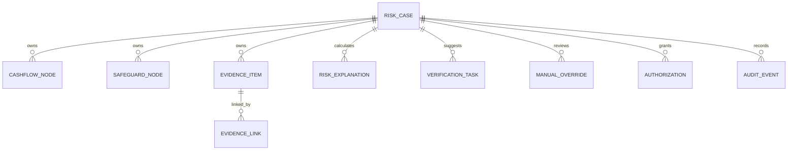

# 数据模型

| 元信息 | 内容 |
| --- | --- |
| 文档版本 | 0.2.0 |
| 文档状态 | 未来 SQLite 设计基线，尚未实现 |
| 负责人 | 架构负责人、数据负责人 |
| 更新时间 | 2026-09-02 |
| 关联文档 | [领域模型](../03-domain/domain-model.md)、[证据护照](../03-domain/evidence-passport.md)、[接口契约](api-contract.md)、[隐私安全](privacy-security.md) |

## 1. 原则

SQLite 只持久化离线模拟或完全脱敏数据。表名使用蛇形命名，日期保存为 `YYYY-MM-DD`，时间保存为 UTC ISO 时间。枚举使用 `CHECK` 约束；正式记录与沙盘临时状态分离，沙盘默认不落库。

## 2. 关系概览

## 3. 核心表

### 3.1 `risk_case`

| 字段 | 类型 | 约束/说明 |
| --- | --- | --- |
| `case_id` | TEXT | 主键，匿名稳定标识。 |
| `scenario_profile` | TEXT | 默认 `SUPPLY_CHAIN_GENERAL`。 |
| `industry` | TEXT | 行业标签；模拟案例显式注明模拟。 |
| `purpose_category` | TEXT | 周转用途类别，不存精确交易。 |
| `reference_date` | TEXT | 合法 ISO 日期。 |
| `guard_date` | TEXT | 不早于参考日。 |
| `rule_status` | TEXT | 五种规则状态之一。 |
| `effective_status` | TEXT | 无覆盖时与规则状态一致。 |
| `confidence_level` | TEXT | `LOW`、`MEDIUM`、`HIGH`。 |
| `version` | INTEGER | 乐观锁版本。 |

### 3.2 `cashflow_node`

包含 `node_id`、`case_id`、`label`、`expected_start`、`expected_end`、`coverage_min_percent`、`coverage_max_percent`、`verification_status`、`is_primary`。数据库约束比例为 0–100 且下界不大于上界；服务层保证每案例唯一主节点。

### 3.3 `safeguard_node`

包含 `node_id`、`case_id`、`safeguard_type`、`label`、`expected_start`、`expected_end`、`verification_status`、`is_primary`。类型限定为 `MATERIAL_READINESS`、`ALTERNATIVE_OPERATING_ARRANGEMENT`、`THIRD_PARTY_SUPPORT_INFORMATION`、`OTHER`。

### 3.4 `evidence_item`

| 字段 | 类型 | 说明 |
| --- | --- | --- |
| `evidence_id` | TEXT | 主键，不含身份信息。 |
| `case_id` | TEXT | 外键。 |
| `source_type` | TEXT | 四种运行时来源。 |
| `stage` | TEXT | 五个证据阶段。 |
| `status` | TEXT | 四种证据状态。 |
| `purpose` | TEXT | 三种用途之一。 |
| `summary` | TEXT | 脱敏摘要。 |
| `source_excerpt` | TEXT NULL | 最小必要脱敏片段，限制长度。 |
| `valid_from` | TEXT NULL | 生效日。 |
| `expires_at` | TEXT NULL | 到期日。 |
| `created_at` / `updated_at` | TEXT | UTC 时间。 |

`visibility_roles` 使用关联表 `evidence_visibility_role(evidence_id, role)`，避免逗号字符串。`evidence_link` 包含 `node_id`、`node_type`、`evidence_id` 的复合唯一键；服务层校验节点存在且类型匹配。

### 3.5 `risk_explanation`

每次正式重算新增版本，保存 `explanation_id`、`case_id`、`calculated_status`、两个差值区间、两个日期区间、两个证据准备度、置信等级、结构化原因、证据缺口、禁止动作、任务建议快照、输入摘要哈希和 `calculated_at`。不覆盖历史版本。

### 3.6 `verification_task`

包含 `task_id`、`case_id`、`task_type`、`title`、`assignee_role`、`priority`、`basis`、`status`、`created_at`、`completed_at`。建议使用 `case_id + task_type + title + active` 业务唯一约束避免活动任务重复。

### 3.7 `manual_override`

保存 `override_id`、`case_id`、`explanation_id`、`rule_status`、`effective_status`、`reason`、`actor_role`、`created_at`、`superseded_at`。原解释和日期差通过 `explanation_id` 保留。

### 3.8 `authorization`

保存 `authorization_id`、`case_id`、`status`、`purpose`、`scope_json`、`granted_at`、`expires_at`、`revoked_at`。导出时每次重新检查 `ACTIVE`、期限和范围。

### 3.9 `audit_event`

保存 `event_id`、`case_id`、`event_type`、`actor_role`、`target_type`、`target_id`、`before_summary`、`after_summary`、`reason_code`、`occurred_at`。不保存原材料、完整摘录、令牌、密钥或可识别字段。

## 4. 提取候选

完整原型如需保存候选，可使用 `extraction_candidate` 表，字段与 `@tide/extraction` 一致，状态仅为 `PENDING_REVIEW`、`ACCEPTED`、`REJECTED`。候选与 `evidence_item` 不做状态复用；接受动作通过新证据标识显式关联，生成的证据初始状态固定为 `PENDING`。

## 5. 一致性与迁移

- 外键开启，写操作使用事务；删除案例仅允许演示重置流程且先归档审计摘要。
- 正式解释按版本追加；更新节点或证据时使用案例版本防止并发覆盖。
- 种子导入为幂等事务，`CASE-DEMO-001` 可重复重置。
- 0.2.0 为破坏性基线，无历史兼容字段；历史归档文档不对应现行数据库。
