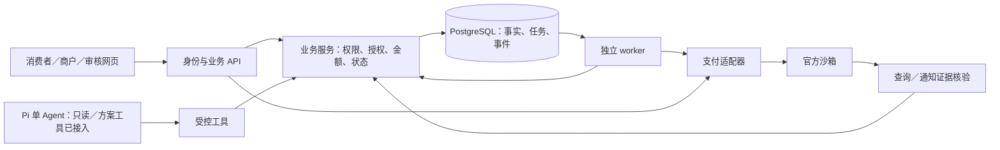

# 系统架构

| 字段 | 内容 |
| --- | --- |
| 文档编号 | XZ-ARCH |
| 更新日期 | 2026-09-12 |
| 状态 | 2026-09-12 已应用 009—011；API-24、交易工具、事件恢复、T10 复核、变更善后连续链和页面衔接已作本地受控核对；DeepSeek V4.1 Flash 已切换为官方 API 标识 `deepseek-flash`，实际检查结果及适用版本见验证记录，真实业务模型证据仍对应旧模型；S4／S5 未放行，详见开发计划 |

## 一、架构目标与选择

第一版采用模块化单体思路：一个 Fastify 业务后端加可独立运行的后台执行者，共享 PostgreSQL；用户界面使用 Vue 3/Vite，全部使用 TypeScript。PostgreSQL 是授权、订单、支付、退款和后台任务的唯一业务事实库。Redis 在本机可用，但只在实际需要时承担可丢失的缓存或限流；不用它保存交易状态、实现唯一幂等或替代后台任务。选择理由是减少部署成本，同时保留业务权限边界。没有独立扩容需求前不拆微服务，也不引入消息队列或第二套工作流框架。

本地实现使用 pnpm 工作区、PostgreSQL 参数化 SQL 与顺序迁移，API 与 worker 共用服务端业务模块；前后端共用必要的字段契约。身份采用测试账号与 PostgreSQL 服务端会话。目录和逐阶段建设任务统一见[分阶段开发计划](development-plan.md)，本文件只规定模块职责；当前已使用的依赖版本以各包的 `package.json` 和锁文件为准，未来新增依赖仍按对应阶段核验。

Pi 只管理单 Agent 模型与工具循环，不与 LangGraph 双重编排；首版固定 `@earendil-works/pi-agent-core@0.85.1`、`@earendil-works/pi-ai@0.85.1`，当前使用 DeepSeek V4.1 Flash（官方 API 标识 `deepseek-flash`，用户简称“ds4.1flash”），不直接派生通用编程助手产品。S4 接入 Pi 主机时仅注册 T01—T10 业务工具，不加载 shell、任意 HTTP、任意文件写入或支付密钥工具。官方价格、运行准入与请求体已作本地核对，新模型业务效果与官方交易仍待验收，选择记录见[ADR](adr/0001-pi-single-agent.md)。

## 二、模块职责

| 模块 | 负责 | 不负责 |
| --- | --- | --- |
| 用户界面 | 对话、确认卡片、官方付款交接、进度与暂停按钮 | 认定付款成功、保存商户密钥 |
| 身份与业务 API | 对象归属、请求校验、方案与授权 | 相信模型传入身份或金额 |
| Pi 运行层 | 构造上下文、选择工具、解释结果与请求澄清；按 ¥100 累计预算和常规令牌桶限流控制模型调用 | 修改交易表、代用户确认、接触支付密钥或任意系统资源 |
| 交易协调模块 | 预算占用、订单操作、幂等与后台任务 | 托管资金或跳过商户规则 |
| 测试商户模块 | 商品、报价、取消规则、退款审核与执行 | 冒充真实票务和酒店 |
| 支付适配器 | 渠道签名、通知核验、查询、关单与退款映射 | 把普通调用成功统一当交易成功 |
| 后台执行者 | 领取任务、有限重试、未知结果核对、人工接管 | 为等待渠道结果不断调用模型 |
| 数据与证据模块 | 业务记录、事件、脱敏回执与导出 | 保存密码、验证码或公开支付链接 |

初版可同进程提供多个业务模块，但商户权限仍通过独立服务边界检查。未来拆部署不改变业务工具契约。

### 2.1 代码落点与依赖方向

下表区分现有文件和待落实边界。模块化单体是目标组织方式，当前并未完成所有业务入口的拆分；实现任务以开发计划为准，不要求创建新包、通用仓储层或独立服务。

| 边界 | 当前落点（相对 `xingzhi/`） | 后续约束 |
| --- | --- | --- |
| 页面与传输 | `apps/web/src/views`、`components`、`lib/api.ts` | 页面只消费服务端快照；HTTP 错误与业务等待分别显示 |
| 字段契约 | `packages/contracts/src/index.ts` | 复用输入校验和公开响应类型；不放 SQL、渠道 SDK、会话凭据或退款执行权限 |
| 身份和接入 | `apps/server/src/auth`、`routes/api.ts` | 路由负责认证、参数解析与响应；将被 UI、Agent、worker 共同使用的业务动作逐项提取，保留既有 API |
| 业务规则与事实 | `domain/access.ts`、`money.ts`、`plans.ts`、`aftercare.ts`；部分写入仍在路由 | 业务服务持有授权、金额、状态和事务；工具不得绕过服务直接操作表 |
| 任务执行 | `domain/jobs.ts`、`domain/worker-runtime.ts`、`domain/channel-worker.ts`、`worker.ts` | 已分派模拟与沙箱渠道任务，统一租约、有限退避、原号查询和人工接管；官方交易证据仍待验收 |
| 支付适配 | `payment/alipay-sandbox.ts`、`domain/channel-worker.ts`、`routes/api.ts` | 已支持交接、交易／退款查询、验签、未付关单和固定号退款；渠道观察与业务事实已在任务结果事务中归并，官方交易仍未联调 |
| 证据和存储 | `domain/events.ts`、`evidence.ts`、`db/migrations` | 事件与业务结果同事务；导出读取已确认事实，不新增交易判据 |
| Agent 运行 | `routes/agent.ts`、`domain/agent-runtime.ts`、`agent-runs.ts`、`agent-tools.ts`、`business-reads.ts`、`proposals.ts`、`agent-proposals.ts`、`model-pricing.ts` | API-24、限流与超时、四个只读工具和两个方案工具已有历史验证；UI 与工具共用查询／方案服务，方案与 WAITING_USER 原子保存；真实模型方案联调及局部执行评测已有记录；交易执行工具、事件恢复、T10 复核和变更善后连续链已接入并作本地受控核对，完整官方链仍待验收 |

允许的依赖为“网页 → API → 业务服务”“Pi 工具 → 业务服务”“worker → 业务服务／支付适配器”。支付适配器只返回经核验的渠道观察，资金事实由业务服务统一归并；API、worker 和模型不分别维护账本。确认与商户执行使用各自专属权限入口，即使复用函数也不能省略调用主体与用途校验。

图示为完整 P0 目标链路，实线表示依赖关系而非实现状态。API 到适配器包含已有的交接生成和主动查单；渠道写动作由持久任务驱动。是否已实现仍以上述代码落点表和开发计划为准。

## 三、执行链路

用户输入交给 Pi；Pi 经工具请求业务查询或提出方案；业务服务校验并保存。用户在确认接口明确授权后，保存确认和授权事件；UI 或 Agent 再调用受控执行入口，由交易协调模块原子保存业务动作、占用与待执行任务。后台执行者在事务外调用商户／渠道，再可靠保存结果。重复执行入口不重复建单或退款。界面展示与 Agent 解释读取同一业务事实。

支付回调从独立入口进入适配器，验签、字段检查及去重后落库，再更新状态与产生后续事件。前端返回页只触发查询，不修改资金事实。网络断开后界面通过快照与事件游标恢复。

### 3.1 三条必须闭合的链路

| 链路 | 准入与持久化 | 外部处理与完成依据 |
| --- | --- | --- |
| 购买付款 | 确认生成授权；建单锁计划并占用；交接复用支付号 | 用户在渠道确认；查询或通知核验后一次性记付款事实；浏览器返回和聊天内容不能记账 |
| 计划变更 | 暂停独立生效；确认保留／停止／关单／取消范围；逐项保存操作 | 保留 A 无取消任务，停止 D 无渠道动作；C 按订单环境关单；B 由商户受理并按固定批次退款 |
| 核对恢复 | 保存原单、固定业务号、主体、用途、授权及下一核对时间 | 查询回原操作归并事实；未知保留占用；超时转可见人工责任，不变更退款号重新试验 |

订单环境来自已持久化对象，不能随当前 `PAYMENT_MODE` 切换而改变。入口准入和 worker 执行前均校验对象、任务类型、适配器与网关是否一致；模拟处理器遇到沙箱对象必须拒绝，不更新状态或释放金额。单独显示环境标签、限制退款按钮或只校验建单入口不足以满足 BR-12。

API-06R 的付款核验属于购买交易核验，消费者只能触发自己的订单；不得要求尚未发生的变更确认先产生善后查询授权。API-25 的消费者受托复核检查查询授权，商户复核检查自身订单及职责。两种主体不能在授权撤回后互相冒用。

## 四、故障边界与恢复

业务状态更新与待执行任务一起提交，外部调用不能包在长数据库事务中。执行者使用有到期时间的领取凭据；超时接管先查外部结果，再决定是否重试。业务编号固定，通信尝试单独记录。

用户暂停和写操作准入竞争由业务数据库处理，而非靠模型消息顺序。服务端已经阻止新购买后，应返回生效版本及在途清单；发送中的付款继续核查。退款追踪不依赖浏览器存活，也不依赖 Pi 会话对象存活。

### 4.1 开发前差距及本轮修正

本节只保留修正缘由和当前边界。开发前曾发现 API-12 可能误把沙箱订单送入模拟关单，业务结果与任务完成分属不同事务，API-06R／API-25 也缺少调用前合并和受控查单；这些问题已在本轮修正。

当前实现将执行逻辑集中在 `domain/worker-runtime.ts` 与 `domain/channel-worker.ts`，HTTP 组装位于 `app.ts`；API-12、API-06R、API-25、渠道通知历史保护和领取版本检查属于此前定向核对范围。此前 31 项切片和后续 429 切片的 36 项自动检查均是历史证据；恢复开发后的交易工具、事件恢复、T10 复核、页面衔接和本次 DeepSeek V4.1 Flash 调用链以开发计划的实现与检查结果为准，真实官方交易、完整模型连续链和 S4／S5 放行仍未完成。

## 五、实现前仍需关闭的决定

首发终端、认证方案、持久数据库、后台模式和本地运行默认值已统一，S1 对应的 pnpm 工作区、Vue／Fastify、PostgreSQL 和 worker 已在本机实现。Pi 与 DeepSeek 的公开版本、模型标识和费用／限流规则已核对；Pi 包已安装且本地无资金循环通过，真实只读／方案联调、局部执行评测、交易工具与事件恢复已有本地证据，但完整官方交易和综合验收仍待完成。沙箱条件及渠道参数在 S2 官方调用前核验。当前不创建云服务器或固定域名部署配置；公开部署条件另行确定，详见[评审议题](../00-governance/review-agenda.md)。详细运行设计见[运行文档](../04-quality/operations.md)。
